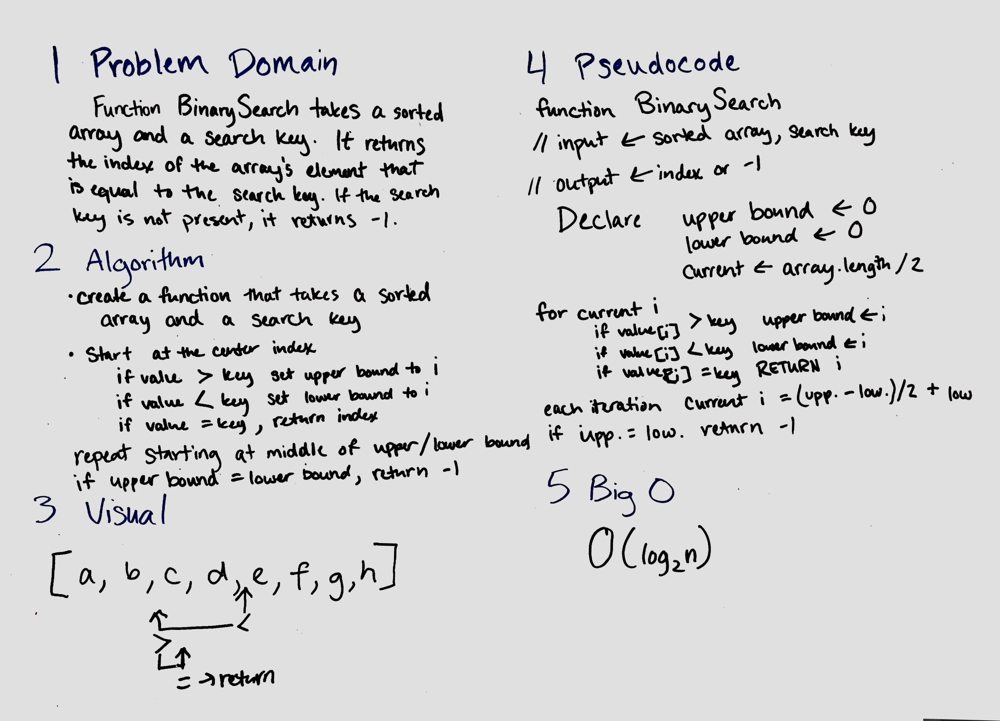

**Data Structures and Algorithms**

# Reverse an Array
Without using built-in array methods, reverse the elements in an array.

## Challenge
Write a function that takes an array as an input and returns an array with the elements in reversed order.

## Solution

# Insert Shift Array
Without using built-in array methods, insert a given value at the center index of an array.

## Challenge
Write a function that takes an array and a value as inputs and returns a new array with the value inserted at the center index of the array.

## Solution

# Binary Search
BinarySearch takes a sorted array and a search key. It returns the index of the array's element that is equal to the search key. If the search key is not present, it returns -1.

## Challenge
Write a function that takes an array and a search key as inputs. Use binary search to find the index of the array's element that is equal to the search key. If it is not present, return -1.

## Solution
