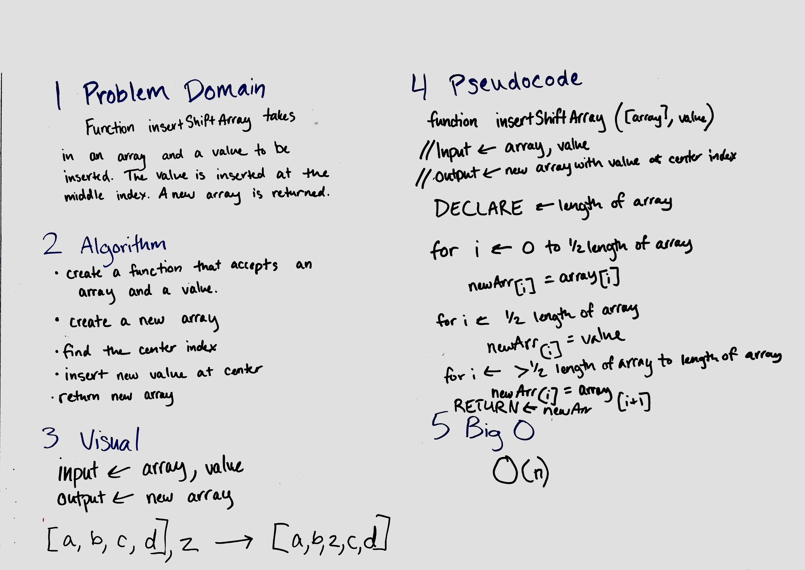

# Reverse an Array
Without using built-in array methods, reverse the elements in an array.

## Challenge
Write a function that takes an array as an input and returns an array with the elements in reversed order.

## Solution

# Insert Shift Array
Without using built-in array methods, insert a given value at the center index of an array.

## Challenge
Write a function that takes an array and a value as inputs and returns a new array with the value inserted at the center index of the array.

## Solution

