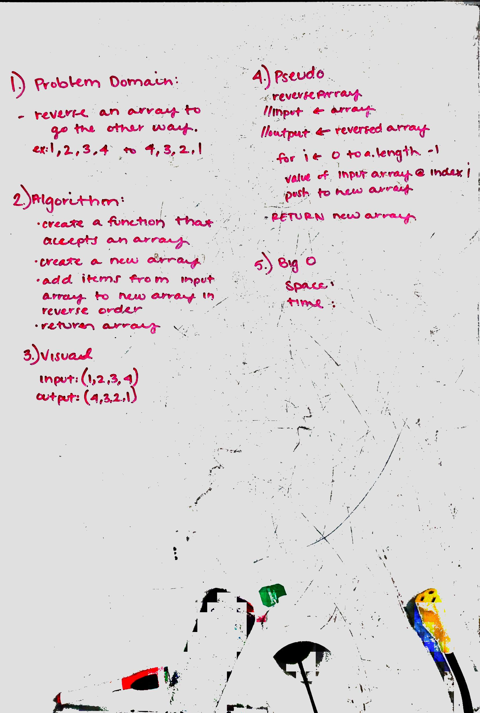

# Reverse an Array
Write a function that takes an array as an input and returns an array with the elements in reversed order.

## Challenge
Write a function that takes an array as an input and returns an array with the elements in reversed order.

## Solution
