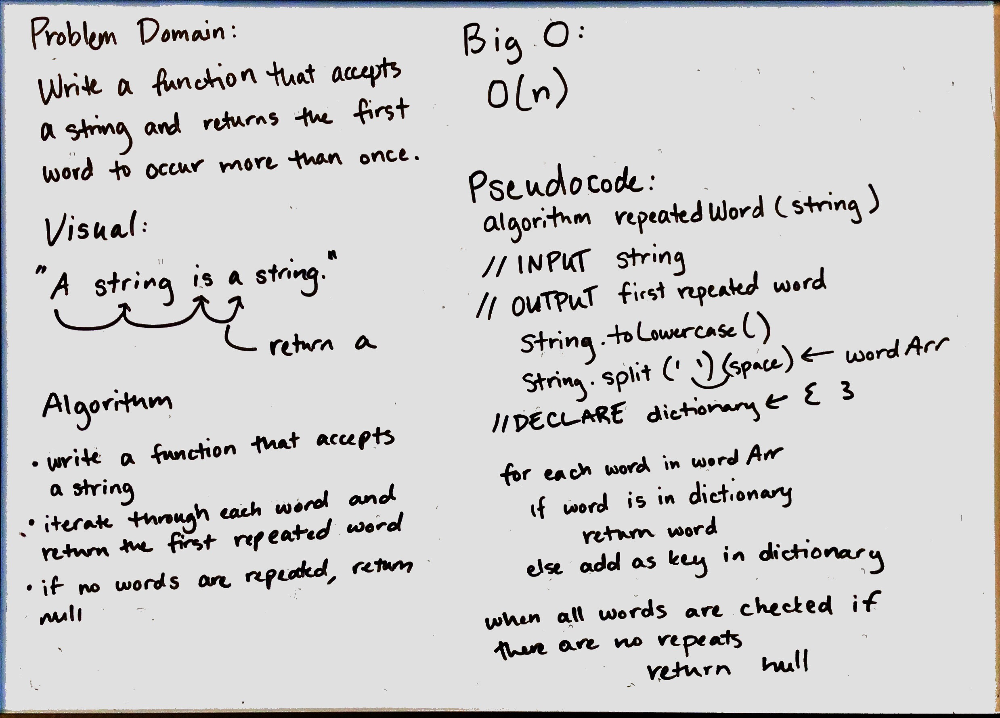

**Data Structures and Algorithms**

# Repeated Word 31
Return the first repeated word in a string.

## Challenge
Write a function that takes a string and returns the first word to occur more than once.

## Solution
