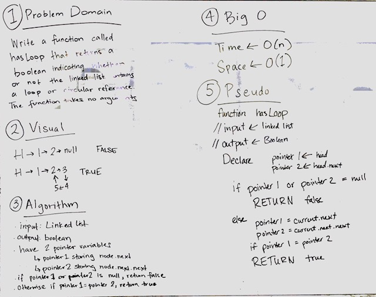

**Data Structures and Algorithms**

**Linked Lists**

This code creates a class for Singly Linked Lists (SLL). This class creates a linked list data structure and creates some methods to use with SLL.

The append(value) method adds a new node with *value* to the last position in the list

# Linked List Insertions 06
Write functions to insert new nodes at the end of a linked list or before or after a node with a given value.

## Challenge
Write functions to insert new nodes in a linked list as follows:
append(value) - write a function to add a new node with *value* to the last position in the list
insertBefore(value, newVal) - write a function to find the first node with *value* and insert a node with newVal directly before it
insertAfter(value, newVal) - write a function to find the first node with *value* and insert a node with newVal direclty after it

## Solution

# Linked List kth From End 07
Write a method to return the value of the node in the kth position from the end.

## Challenge
Write a function which takes in a number, k. Find the end of the linked list, then return the kth value before the end.

## Solution

# Linked List Merge 08
Write a method to merge two linked lists into one, alternating nodes between input lists.

## Challenge
Write a function which takes in two linked lists and creates a new linked list. The new list consists of the values from each of the input nodes, alternating between list 1 and list 2.

## Solution

# Linked List Detect Loop 09
Write a method to detect whether a linked list contains a circular reference.

## Challenge
Write a function which takes in a linked list and returns a Boolean - true if the list contains a circular reference and false if it does not.

## Solution
