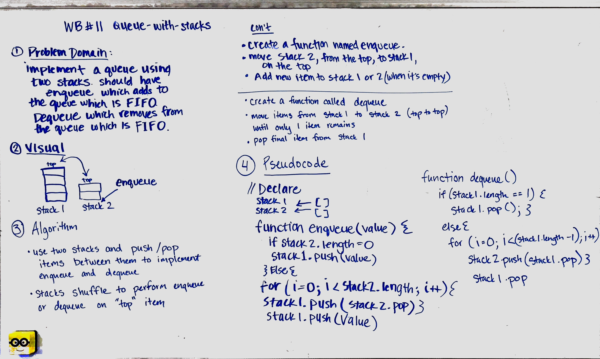
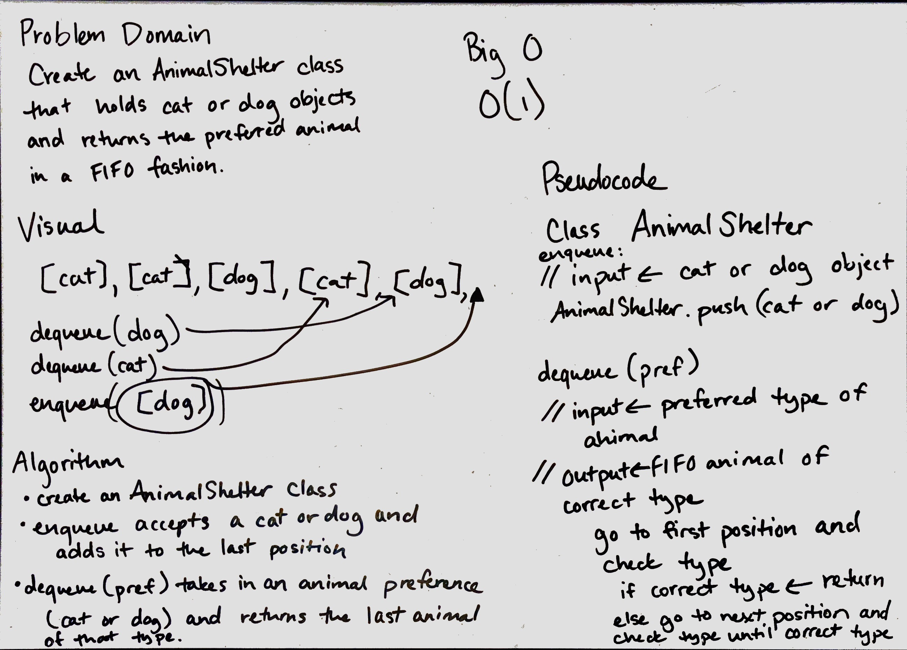
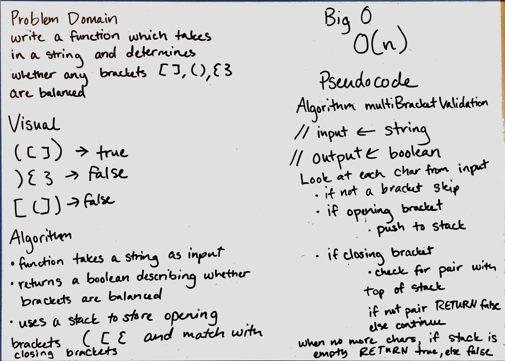

#Data Structures and Algorithms

##Stacks and Queues

This code creates two classes - one for Stacks and one for Queues. These classes create the respective data structures and creates some methods to use with them.

###Stacks

- The push(value) method adds the *value* to the last position in the stack
- The pop() method removes and returns the last item in the stack

###Queues

- The enqueue(value) adds the *value* to the last position in the queue
- The dequeue() method removes and returns the first item in the queue

###Tests

Tests can be run in node.js using npm test, or checked on Travis at the link at the top of this README.

## Implement a Queue using two Stacks 11
Implement a queue using two stacks.

## Challenge
Using two stacks and their push(val) and pop() methods, implement a queue with enqueue(val) and dequeue() methods.

## Solution

## First-in, First out Animal Shelter 12
Create an AnimalShelter class which holds cats and dogs, and operates as a FIFO animal shelter.

## Challenge
Create an AnimalShelter class which holds animals - either cat or dog objects. enqueue() adds an animal to the shelter. dequeue(pref) returns the longest-waiting preferred animal (cat or dog).

## Solution

## Multi-bracket Validation 13
Write a function which takes in a string which may contain brackets [], {}, () and determines whether the brackets are balanced.

## Challenge
multiBracketValidation(input) is a function which takes in a string which may contain brackets [], {}, (). It determines whether the brackets are balanced and returns a boolean.

## Solution
