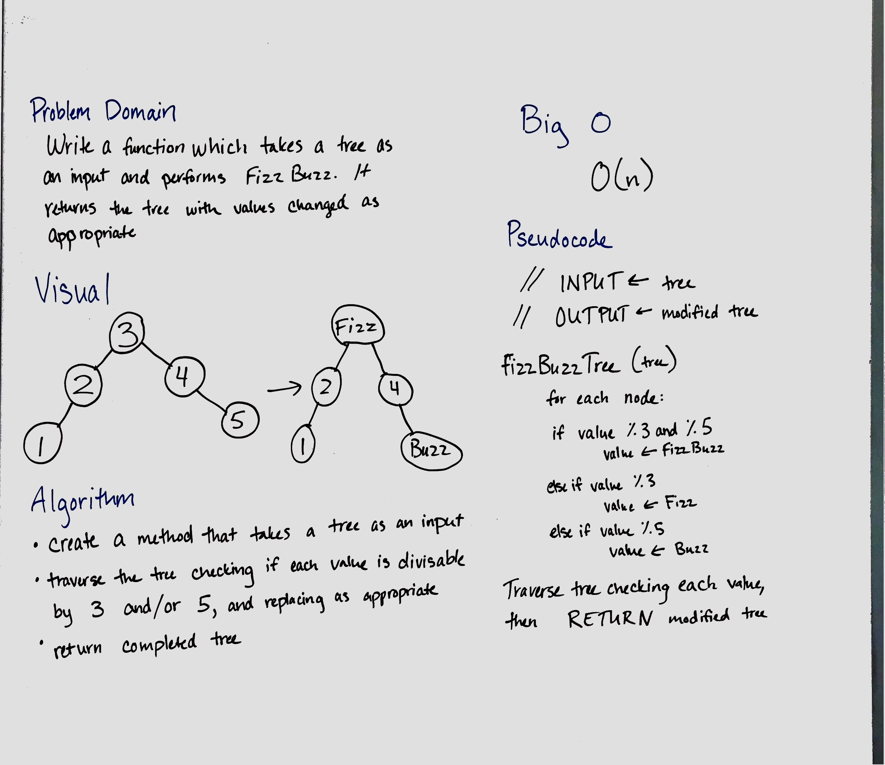

**Data Structures and Algorithms**

**Binary Trees**

This code creates a class for Binary Trees. This class creates a binary tree data structure and creates some methods to use with it.

The insert(value) method adds a new node with *value* to the correct position in the tree.

# Linked List Insertions 1
Write a function called FizzBuzzTree which takes a tree as an argument and performs the classic "FizzBuzz" function.

## Challenge
Without utilizing any of the built-in methods, determine whether or not the value of each node is divisible by 3, 5 or both, and change the value of each of the nodes respectively. Return the tree with its new values.

## Solution
