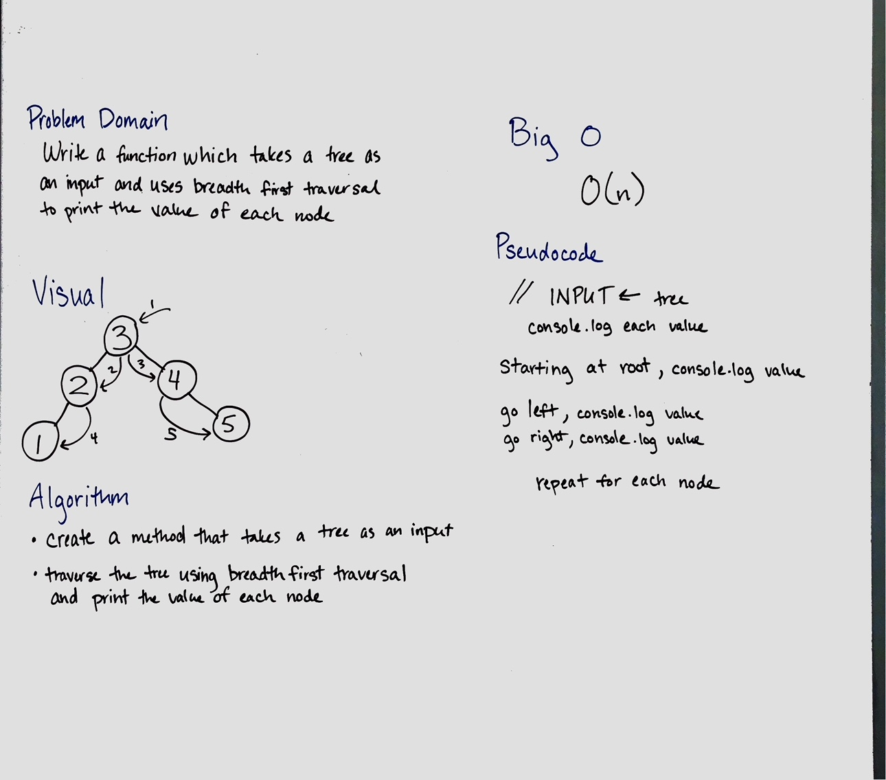
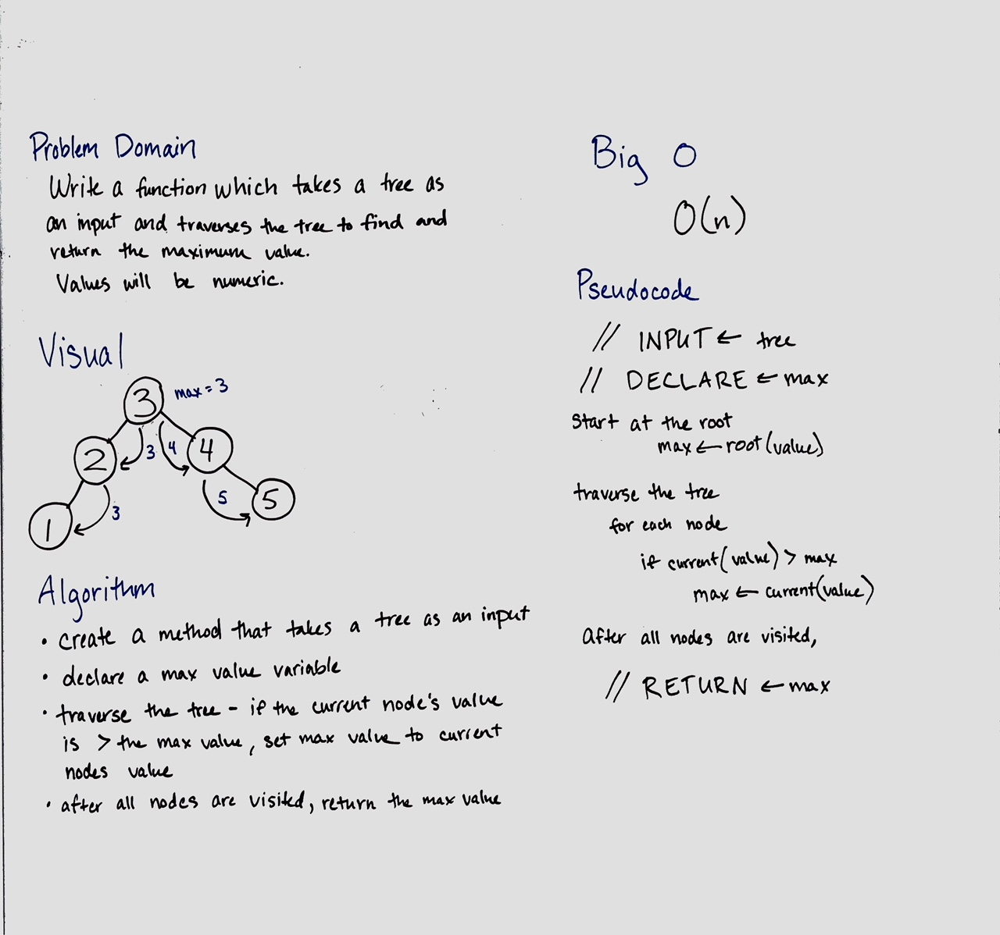

**Data Structures and Algorithms**

**Binary Trees**

This code creates a class for Binary Trees. This class creates a binary tree data structure and creates some methods to use with it.

The insert(value) method adds a new node with *value* to the correct position in the tree.

The find(value) method finds a node with a specific value and returns it.

# FizzBuzz Tree 16
Write a function called FizzBuzzTree which takes a tree as an argument and performs the classic "FizzBuzz" function.

## Challenge
Without utilizing any of the built-in methods, determine whether or not the value of each node is divisible by 3, 5 or both, and change the value of each of the nodes respectively. Return the tree with its new values.

## Solution

# Breadth First Traversal 17
Write a function called breadthFirstTraversal which takes a tree as an argument and traverses the tree breadth first, logging all values

## Challenge
Without utilizing any of the built-in methods available to your language, traverse the input tree using a Breadth-first approach; print every visited node’s value.

## Solution

# Find Maximum Value 18
Write a function called findMaximumValue which takes a tree as an argument and traverses the tree keeping track of the maximum value. After all nodes are visited, return the maximum value.

## Challenge
Without utilizing any of the built-in methods available to your language, return the maximum value stored in the tree. You can assume that the values stored in the Binary Tree will be numeric.

## Solution
